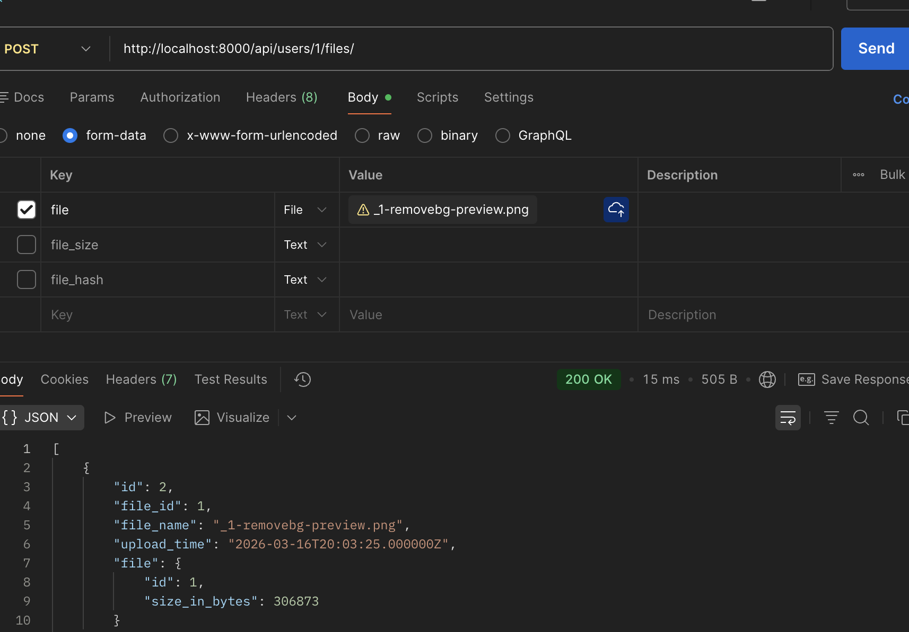
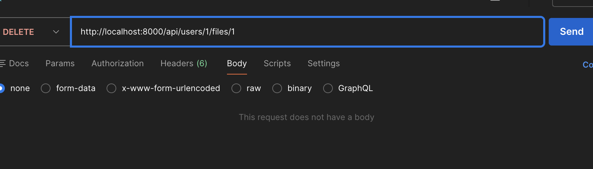
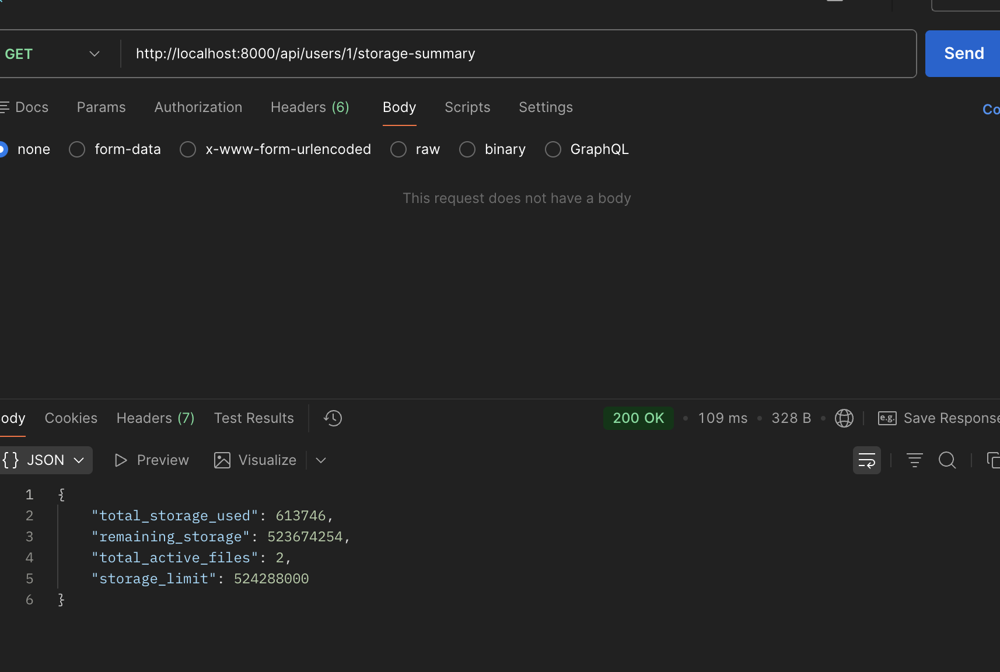
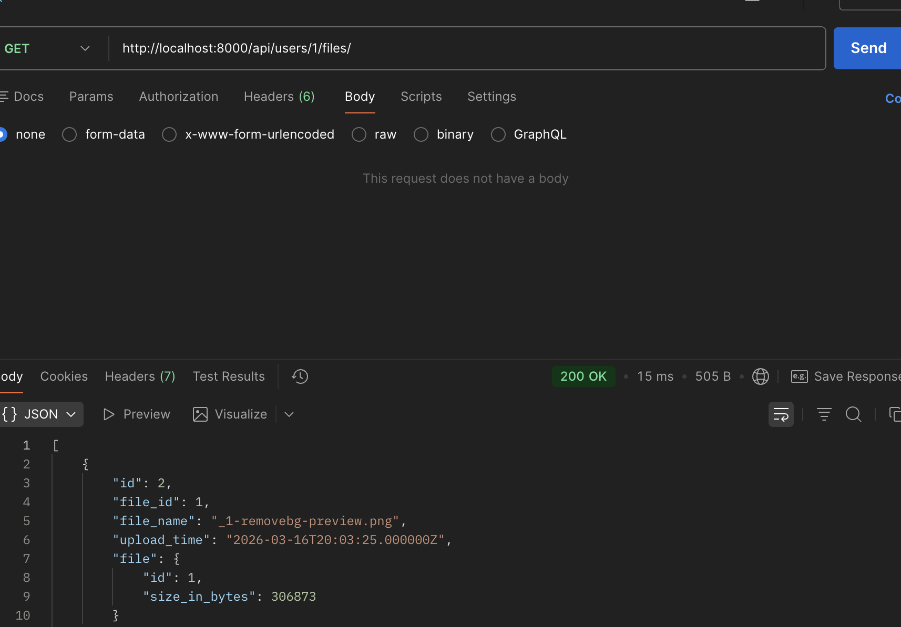

Have to migrate the migrations **php artisan  migrate**
Then **php artisan serve**

**Upload File**
POST [/users/{user_id}/files](/users/{user_id}/files)
 [/users/1/files](/users/1/files)

**Delete File**
DELETE [/users/{user_id}/files/{file_id}](/users/{user_id}/files/{file_id})
[/users/1/files/1](/users/1/files/1)

**Get Storage Summary**
GET [/users/{user_id}/storage-summary](/users/{user_id}/storage-summary)
[/users/1/storage-summary](/users/1/storage-summary)

**List User Files**
GET [/users/{user_id}/files](/users/{user_id}/files)
[/users/1/files](/users/1/files)

